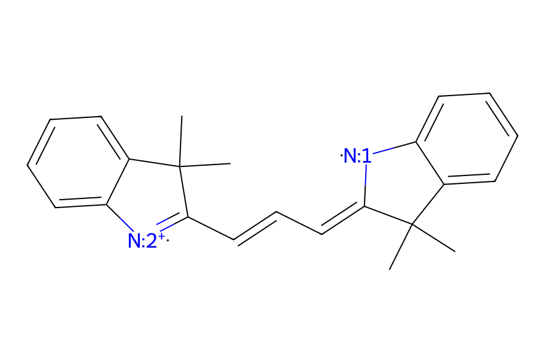
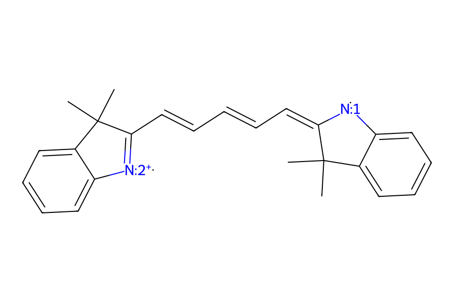
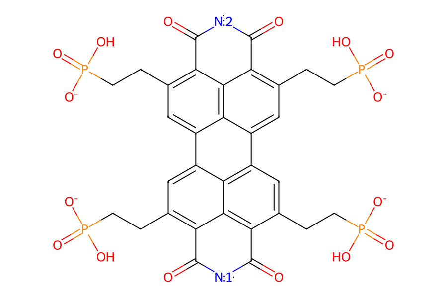
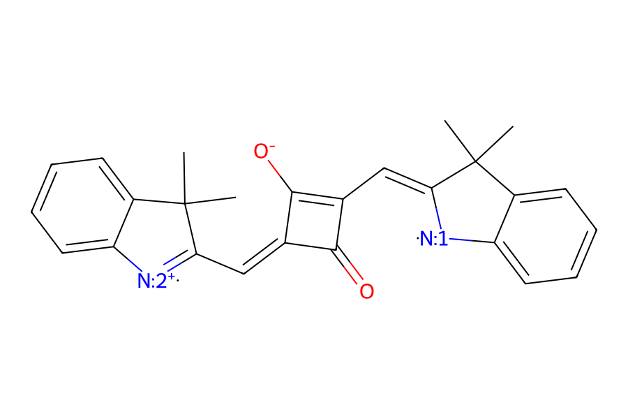
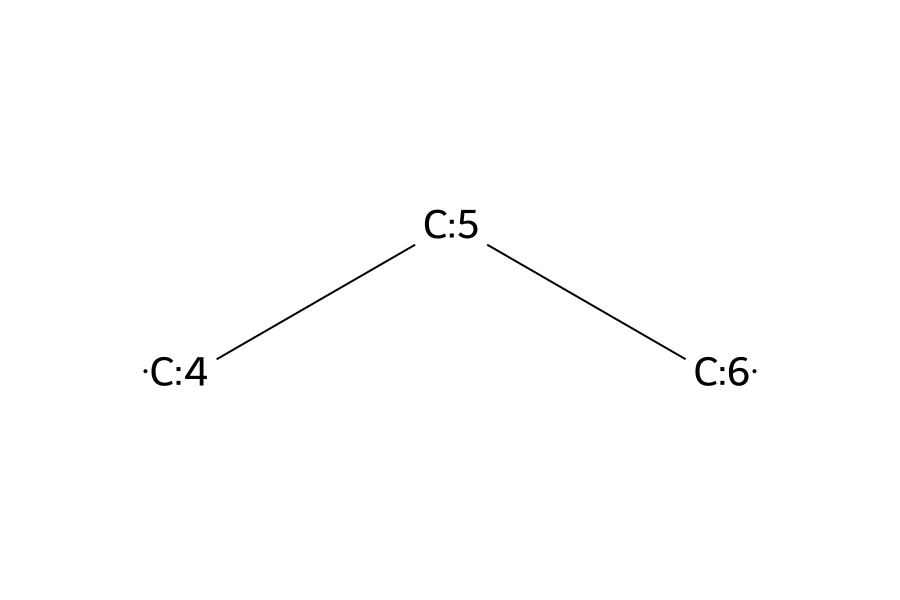
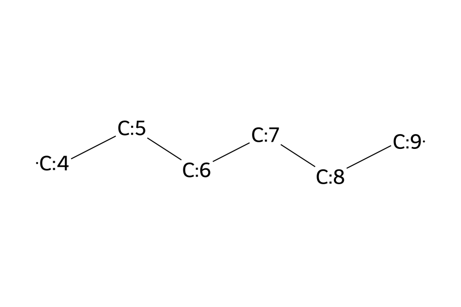
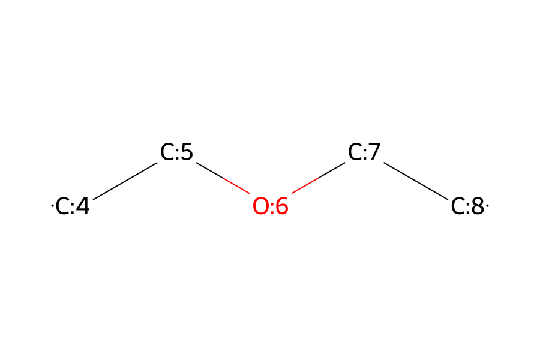

# Example Libraries

This directory contains example molecular-library entries that match the runtime configuration model:

- `libraries/dye_lib` can be used as an example `libraries.dye_dir`.
- `libraries/lnk_lib` can be used as an example `libraries.linker_dir`.
- An example `libraries/dna_lib` still needs to be added for `libraries.dna_dir`.

These entries show the expected layout for reusable dye and linker components. The listed attachment sites are taken from the `.attach` files present in the example library.

## Dyes

| Code | Structure | Description | Attachment sites |
| --- | --- | --- | --- |
| `CY3` |  | Dye library entry with GAFF2 MOL2/FRCMOD files. | `N1`, `N2` |
| `CY5` |  | Dye library entry with GAFF2 MOL2/FRCMOD files. | `N1`, `N2` |
| `PDI` |  | Dye library entry with GAFF2 MOL2/FRCMOD files. | `N1`, `N2` |
| `SQA` |  | Dye library entry with GAFF2 MOL2/FRCMOD files. | `N2`, `N1` |

## Linkers

| Code | Structure | Description | Attachment sites |
| --- | --- | --- | --- |
| `C3` |  | Linker library entry with `C33` and `C35` GAFF2/OL15 variants. | `C33`: `P1`, `C3`; `C35`: `C3`, `O2` |
| `C6` |  | Linker library entry with `C63` and `C65` GAFF2/OL15 variants. | `C63`: `P1`, `C3`; `C65`: `C3`, `O2` |
| `DE` |  | Linker library entry with `DE3` and `DE5` GAFF2/OL15 variants. | `DE3`: `P1`, `C3`; `DE5`: `C3`, `O3` |

The linker library also contains `libraries/lnk_lib/connect/gaff2/OL15/connectparms.frcmod`, a curated DNA-linker compatibility parameter file used by dye-linker assembly.
